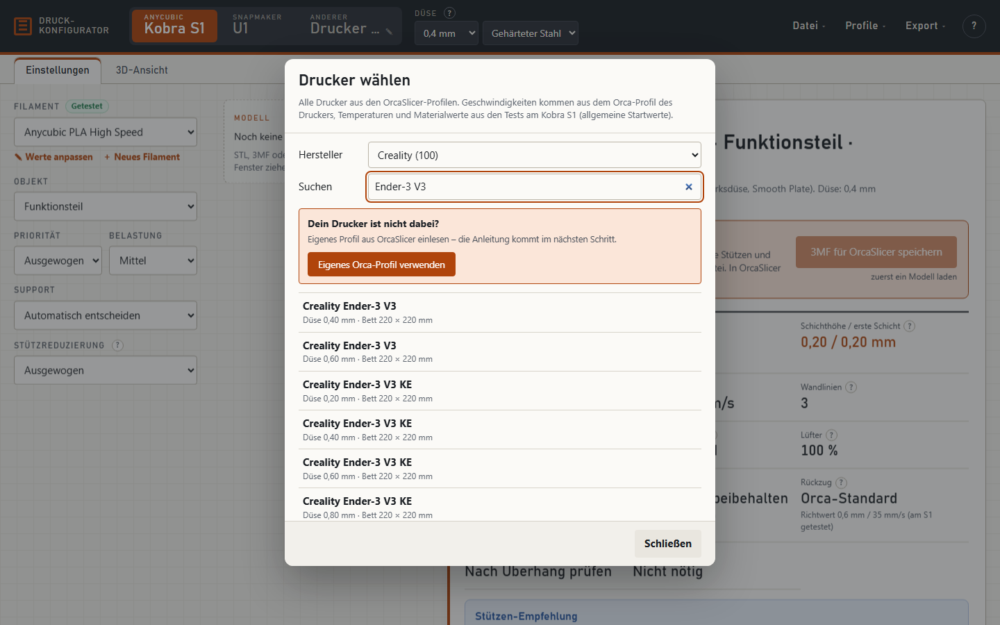
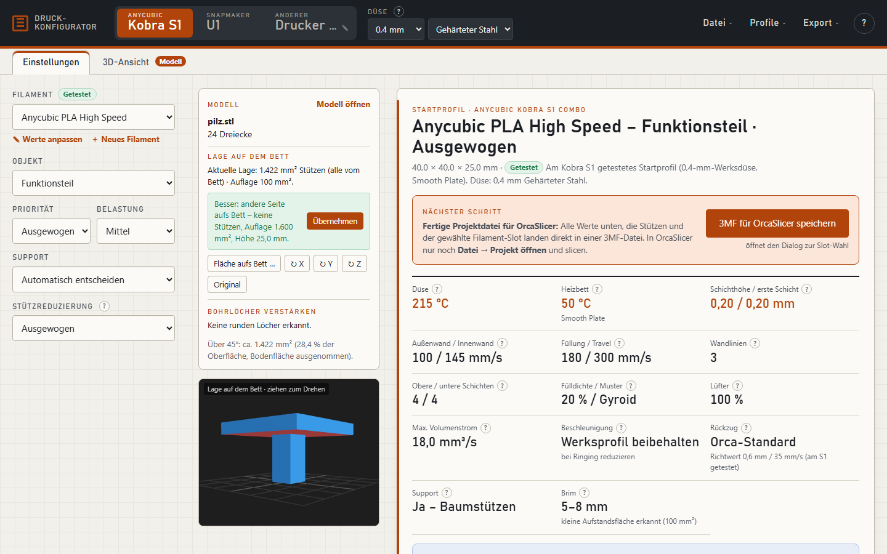
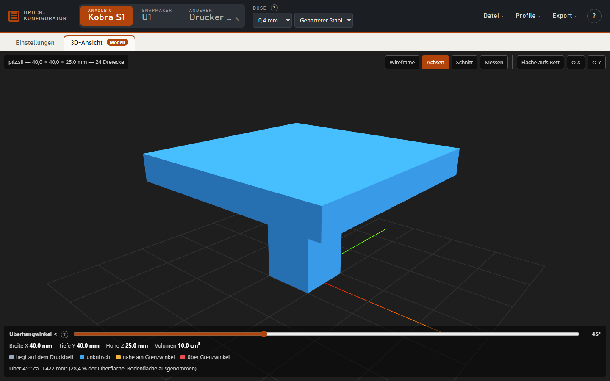

# Druck-Konfigurator – Handbuch

Der Druck-Konfigurator berechnet passende Startwerte für den **Anycubic Kobra S1 (Combo)** und den **Snapmaker U1** und schreibt sie direkt in eine Projektdatei für **OrcaSlicer**. Du lädst ein Modell, das Tool prüft Maße und Überhänge, schlägt die beste Lage auf dem Bett vor und liefert eine 3MF-Datei, die in Orca sofort mit den richtigen Werten öffnet.

Alles läuft lokal in deinem Browser. Es werden keine Modelle oder Daten ins Internet geschickt.

> **Hinweis:** Alle Werte sind Startwerte ohne Gewähr. Filamente unterscheiden sich je nach Hersteller und Charge – die Angaben auf der Rolle haben Vorrang. Die Slicer-Vorschau immer prüfen. Nutzung auf eigene Verantwortung – den vollständigen **Haftungsausschluss** findest du in der [README](README.md#haftungsausschluss) und im Tool unter **? → Haftungsausschluss**.

---

## Inhalt

1. [Installation und Start](#1-installation-und-start)
2. [Die Oberfläche](#2-die-oberfläche)
3. [Modell laden](#3-modell-laden)
4. [Mehrere Teile](#4-mehrere-teile)
5. [Lage auf dem Bett](#5-lage-auf-dem-bett)
6. [Einstellungen und Datenblatt](#6-einstellungen-und-datenblatt)
7. [Eigene Filamentwerte und Profile](#7-eigene-filamentwerte-und-profile)
8. [Drucker-Verbindung (Filament-Belegung live)](#8-drucker-verbindung-filament-belegung-live)
9. [3MF für OrcaSlicer speichern](#9-3mf-für-orcaslicer-speichern)
10. [Makerworld-Projekte umstellen](#10-makerworld-projekte-umstellen)
11. [3D-Ansicht](#11-3d-ansicht)
12. [Grenzen und bekannte Einschränkungen](#12-grenzen-und-bekannte-einschränkungen)
13. [Probleme lösen](#13-probleme-lösen)

---

## 1. Installation und Start

**Online:** https://wolfb63-del.github.io/druck-konfigurator/ – ohne Download, auch auf Mac, Linux und Tablet. Die Live-Abfrage vom Drucker geht dort nicht; „Belegung eintragen“ schon. Eigene Filamentwerte speichert der Browser getrennt von der heruntergeladenen Version.

**Voraussetzungen:** Windows, macOS oder Linux mit einem aktuellen Browser (Chrome, Edge, Firefox oder Safari) und OrcaSlicer. Getestet ist Windows mit Chrome; auf Mac und Linux sollte es genauso laufen. **Keine Installation nötig.** Nur wer die Filament-Belegung live vom Drucker lesen will (Rinkhals/Moonraker), braucht zusätzlich [Python](https://www.python.org) (Version 3.8 oder neuer).

1. Das Projekt als ZIP herunterladen (auf GitHub: **Code → Download ZIP**) und in einen Ordner entpacken, z. B. `C:\Druck-Konfigurator`.
2. Starten – zwei Möglichkeiten:
   - **Normal:** Doppelklick auf **`index.html`**. Alles funktioniert; die Filament-Belegung trägst du einmal im Export-Dialog ein (siehe [Kapitel 9](#9-3mf-für-orcaslicer-speichern)).
   - **Mit Live-Abfrage** (nur Rinkhals/Moonraker, braucht Python): unter Windows Doppelklick auf **`Konfigurator starten.cmd`**; unter Mac/Linux im Projektordner im Terminal `python3 tools/serve.py` eingeben und im Browser `http://127.0.0.1:8765` öffnen. Es öffnet sich ein schwarzes Fenster (lokaler Webserver) und der Browser mit dem Tool. Das Fenster offen lassen, solange du das Tool benutzt. Der Server ist nur auf deinem PC erreichbar. Direkt geöffnet (`index.html`) blockiert der Browser die Antworten der Drucker.

> Deine eigenen Filamentwerte speichert der Browser getrennt je Startart. Bleib deshalb bei einer Startart – oder übertrage die Werte über **Profile → Profile exportieren/importieren**.

---

## 2. Die Oberfläche

- **Kopfzeile:** Drucker umschalten (**Kobra S1** / **U1** / **Anderer Drucker …**), Düsengröße und Düsenmaterial.

### Anderer Drucker

Über **Anderer Drucker …** wählst du aus rund 990 Druckern von 63 Herstellern – dieselbe Liste wie in OrcaSlicer. Hersteller wählen, Namen eintippen (z. B. „Ender“, „MK4“, „P1S“), Drucker mit passender Düse anklicken.

- **Geschwindigkeiten, Beschleunigung und Volumenstrom** höchstens so hoch wie im OrcaSlicer-Profil des Druckers – ein langsamer Drucker bleibt bei seinen Werten, TPU trotzdem langsam.
- **Temperaturen und Materialwerte** stammen aus den Tests am Kobra S1 und gelten hier als allgemeine Startwerte.
- Die **3MF** enthält Druckerprofil, Prozessprofil und passende Filamentprofile des Herstellers aus OrcaSlicer; Orca lädt beim Öffnen genau diese Profile.
- Heizt der Start-G-Code eines Herstellerprofils fest auf eine Temperatur (bei rund 20 Profilen, z. B. LONGER LK10), warnt das Datenblatt – Orca würde sonst mit dieser festen Temperatur drucken.
- Kobra S1 und U1 nutzen weiterhin deine eigenen Orca-Vorlagen und die Live-Abfrage.

**Drucker nicht dabei?** In der Auswahl direkt unter dem Suchfeld auf **Eigenes Orca-Profil verwenden** klicken. Das Tool liest dann dein eigenes OrcaSlicer-Profil ein:

1. In OrcaSlicer deinen Drucker anlegen bzw. auswählen (Hersteller-Profil oder eigene Werte für Bett, Düse, Firmware).
2. Ein **neues, leeres Projekt** mit diesem Drucker – es muss kein Modell geladen sein.
3. **Datei → Projekt speichern unter …** als .3mf.
4. Diese Datei im Dialog auswählen. Der Drucker erscheint oben als **Eigener** und bleibt im Browser gespeichert.

Alle so angelegten Drucker stehen danach in der Auswahl unter **★ Eigene Drucker** ganz oben in der Herstellerliste – dort wieder auswählen oder über **Entfernen** löschen.

**Keine Makerworld-Datei verwenden:** Eine Datei von Makerworld enthält das Druckerprofil des Designers (meist ein Bambu-Drucker), nicht den auf der Seite gewählten Drucker. Das Tool erkennt solche Dateien und lehnt sie hier ab – Makerworld-Dateien über **Modell öffnen** laden und oben deinen Drucker wählen.

Einschränkung: Filamentprofile werden nicht nach Materialtyp (PLA/PETG/…) gewechselt – jeder Slot behält das Profil, das beim Speichern in Orca eingestellt war. Nach dem Export in Orca ggf. das passende Filamentprofil je Slot wählen. Temperaturen und Geschwindigkeiten aus dem Datenblatt landen trotzdem in der 3MF.

- **Menüs:**
  - **Datei** – Modell öffnen, Modell entfernen
  - **Profile** – Filamentwerte anpassen, neues Filament, eigene Profile, Import/Export, Düsen-Umrechnung, Drucker-Verbindung
  - **Export** – 3MF für OrcaSlicer, Filament-/Process-JSON, Drucken/PDF, als Text kopieren
  - **?** – Kurzhilfe
- **Registerkarten:** **Einstellungen** (Auswahl und Datenblatt) und **3D-Ansicht**.
- Neben vielen Werten steht ein **?** – mit der Maus darauf zeigen (oder antippen) für eine Erklärung.

---

## 3. Modell laden

Über **Datei → Modell öffnen** oder einfach per Drag & Drop ins Fenster. Möglich sind:

| Datei | Was passiert |
|---|---|
| **STL** | Wird eingelesen; stecken mehrere getrennte Körper darin, werden sie als einzelne Teile erkannt. |
| **mehrere STLs** | Alle zusammen als ein Projekt mit Teileliste. |
| **3MF** | Objekte, Platten und Slot-Zuweisung werden übernommen (Modifier und Hilfskörper werden nicht als Teil gezählt). |
| **ZIP** (z. B. von Makerworld) | Wird entpackt. Liegt genau eine 3MF darin, wird diese verwendet, sonst alle STLs. |

Körper, die sich berühren oder überlappen, bleiben ein Teil – z. B. Hohlkörper oder unverschmolzene Exporte aus Tinkercad.

---

## 4. Mehrere Teile

Bei mehreren Teilen erscheint in der Modellkarte eine **Teileliste**. Jede Zeile zeigt Name, Maße, Slot, ob das Teil Stützen braucht und darunter die **Stabilität** (stabil / schwach / kritisch, dazu die dünnste Wand und „Z“ bei einer schlanken Stelle in Z; Details beim Darüberfahren). Die Stabilität wird nach dem Laden Teil für Teil im Hintergrund berechnet („Stabilität …“) – nur Hinweis, siehe 3D-Ansicht.

- **Anklicken wählt ein Teil.** Das Formular links, das Datenblatt und die 3D-Ansicht gelten dann für dieses Teil – oben im Formular steht **„Einstellungen für Teil“** mit dem Namen.
- Jedes Teil merkt sich **eigenes Filament, Objektart, Priorität, Belastung, Support und Stützreduzierung**.
- Über **Slot** kannst du jedem Teil einen eigenen Filament-Slot geben. „Wie beim Export gewählt“ bedeutet: Das Teil bekommt den Standard-Slot aus dem Export-Dialog.

---

## 5. Lage auf dem Bett

Unter **Lage auf dem Bett** bewertet das Tool, wie viele Stützen die aktuelle Lage braucht und wie viel Auflagefläche das Teil hat. Es prüft die großen ebenen Flächen des Teils als mögliche Auflage und schlägt eine bessere Lage vor, wenn sie deutlich weniger Stützen braucht.

- Stützen, die **auf dem Teil selbst** oder in Löchern stehen, zählen dreifach: Sie gehen schwerer ab und hinterlassen Spuren.
- Sehr wenig Auflagefläche (Kippgefahr) wird ebenfalls berücksichtigt.
- **Übernehmen** dreht das Teil in die vorgeschlagene Lage.
- **Fläche aufs Bett …** – wechselt in die 3D-Ansicht; die Fläche anklicken, die unten liegen soll (Esc bricht ab).
- **↻ X / ↻ Y / ↻ Z** – um 90° drehen. **Original** – Lage aus der Datei.
- Wird ein Teil, das als **kritisch** eingestuft ist, durch den Vorschlag in Z schwächer (eine schmale Stelle stünde aufrecht), steht unter dem Vorschlag ein gelber Hinweis **„Achtung Stabilität“**. Dann weniger Stützen gegen Festigkeit abwägen. Das ist nur eine Näherung. Der Hinweis erscheint beim Einzelvorschlag, nicht bei „Alle Teile nach Vorschlag ausrichten“.
- Bei mehreren Teilen: **Alle Teile nach Vorschlag ausrichten**.
- Unter der Modell-Karte zeigt eine **kleine 3D-Vorschau** das gewählte Teil in seiner aktuellen Lage – rot eingefärbte Flächen brauchen Stützen. Ziehen dreht die Ansicht, das Mausrad zoomt.

Bei 3MF-Projekten bleibt die Lage des Designers erhalten; Drehen ist dort gesperrt.

### Bohrlöcher verstärken

Unter **Bohrlöcher verstärken** listet das Tool die runden Löcher des gewählten Teils auf – senkrecht und waagerecht, mit Durchmesser, Tiefe und Lage. Nichts wird automatisch geändert: Setze ein **Häkchen** bei den Löchern, die Last tragen (z. B. Schraubenlöcher). Beim 3MF-Export bekommt jedes angehakte Loch in Orca einen **Modifikator**: einen Ring von 3 mm rund um das Loch mit **100 % Füllung**. Dort ist das Teil dann massiv und verteilt die Last der Schraube besser.

- Nach einer Drehung wird neu erkannt, die Häkchen werden zurückgesetzt.
- Nur bei STL-Teilen; Makerworld-Projekte bleiben unverändert.
- In Orca erscheint der Modifikator unter dem Objekt als „Verstärkung Loch …“ und lässt sich dort anpassen oder löschen.

### Stabilität (Hinweis)

Unter **Stabilität** bewertet das Tool das gewählte Teil, auch wenn das Projekt nur ein Teil hat: **stabil**, **schwach** oder **kritisch**, mit dünnster Wand bzw. der Stelle, die in Z schwach ist. Bei schwachen oder kritischen Teilen folgen Vorschläge, etwa die Wand im Modell zu verstärken, eine liegende Lage zu wählen oder mehr Wände bzw. mehr Füllung zu verwenden. Dieselbe Bewertung steht im Datenblatt unter den Hinweisen.

Das ist eine **Näherung aus der Geometrie, keine Festigkeitsberechnung**. Das Tool ändert keine Druckwerte und auch nicht den 3MF-Export. Was du übernehmen willst, stellst du selbst in OrcaSlicer ein. Farbkarte und Grenzen: siehe 3D-Ansicht (Abschnitt 11) und Abschnitt 12.

---

## 6. Einstellungen und Datenblatt

Links wählst du **Filament, Objektart, Priorität, Belastung, Support** und **Stützreduzierung**. Rechts steht das **Datenblatt** mit den wichtigsten Werten (Temperaturen, Schichthöhe, Geschwindigkeiten, Wände, Füllung, Stützen, Brim) und aufklappbar:

- **Einstellungen in Slicer-Reihenfolge** – alle Werte in der Reihenfolge der Slicer-Registerkarten
- **Stützparameter** – alle Stützwerte (Abstände, Schnittstelle, Baum-Parameter)
- **Hinweise** – Warnungen, z. B. zu Material und Düse
- **OrcaSlicer-Import (JSON)** – Alternative zum 3MF-Export

**Wasserdicht / Behälter:** Diese Objektart setzt mindestens 4 Wandlinien, 5 Deck- und 6 Bodenschichten, 5 °C mehr Düsentemperatur, eine langsamere Außenwand und in Orca „Lückenfüllung überall“. Die Hinweise nennen weitere Tipps (Vasenmodus für einfache Gefäße, Epoxid-Beschichtung). Nicht für Trinkwasser oder Lebensmittel – nach dem Druck mit Wasser testen.

**Stützen:** Das Tool empfiehlt Baumstützen, wenn das Teil relevante Überhänge hat. Der Abstand zwischen Stütze und Teil entspricht einer Schichthöhe (PETG 0,05 mm mehr, weil es stärker haftet) – so halten die Stützen sicher und lassen sich trotzdem lösen.

**Düsen-Umrechnung:** Für 0,2/0,25/0,6/0,8 mm und andere Düsenmaterialien rechnet das Tool die Werte um. Der 3MF-Export ist derzeit nur mit der **0,4-mm-Düse** möglich.

---

## 7. Eigene Filamentwerte und Profile

- **Werte anpassen** (unter der Filament-Auswahl oder im Menü **Profile**): eigene Temperatur, Geschwindigkeit, Lüfter usw. speichern. Alle Empfehlungen rechnen danach mit deinen Werten.
- **Neues Filament:** zusätzliches Profil, z. B. für eine bestimmte Marke.
- **Profile exportieren/importieren:** eigene Werte als Datei sichern oder auf einen anderen PC übertragen.

---

## 8. Drucker-Verbindung (Filament-Belegung live)

> **Nur mit Klipper/Moonraker.** Mit der Werksfirmware geht das bei keinem der beiden Drucker – dann stattdessen die Belegung im Export-Dialog unter „Belegung eintragen“ von Hand angeben (siehe [Kapitel 9](#9-3mf-für-orcaslicer-speichern)).

Unter **Profile → Drucker-Verbindung** trägst du die IP-Adressen deiner Drucker im Heimnetz ein und testest die Verbindung. Das Tool fragt dann beim Export die **tatsächliche Filament-Belegung** (Typ und Farbe je Slot) ab.

**Voraussetzung: Moonraker.** Das bringt bei beiden Druckern eine Fremd-Firmware mit – nicht vom Hersteller, Installation und Nutzung auf eigene Verantwortung, Anleitung jeweils beim Projekt selbst:

- **Anycubic Kobra S1:** [Rinkhals](https://jbatonnet.github.io/Rinkhals/)
- **Snapmaker U1:** [Extended Firmware von paxx12](https://github.com/paxx12-snapmaker-u1/SnapmakerU1-Extended-Firmware)

Weiteres:

- Das Tool **liest nur** – es sendet keine Befehle an den Drucker.
- Läuft der Drucker ohne Moonraker (Werksfirmware), bleibt die Belegung aus deiner Orca-Vorlage – oder trage sie unter „Belegung eintragen“ selbst ein.
- Antwortet der Drucker trotz Moonraker nicht, wird ebenfalls die Vorlage verwendet.

---

## 9. 3MF für OrcaSlicer speichern

Der Knopf **„3MF für OrcaSlicer speichern“** direkt oben im Datenblatt (oder **Export → 3MF für OrcaSlicer …** im Menü) öffnet den Dialog:

1. **Belegung prüfen** – was steckt in welchem Slot? **Belegung eintragen** öffnet je Slot eine Auswahl für Filamenttyp und Farbe; das bleibt gespeichert, bis du es änderst (z. B. nach einem Spulenwechsel). **Eingabe löschen** entfernt sie wieder. Ohne Eingabe oder Live-Abfrage zeigt das Tool nur die Slot-Nummern – welches Filament wo steckt, weißt du selbst am besten. Mit Rinkhals/Moonraker holt **Vom Drucker laden** die Belegung automatisch.
2. **Slot wählen** – bei einem Teil der Slot, bei mehreren der Standard-Slot für Teile ohne eigenen Slot.
3. Bei mehreren Teilen zeigt die Tabelle **Teil · Slot · Filament · eigene Werte**. Passt das Filament eines Teils nicht zum Slot, hilft **„Filament … passend zur Belegung wählen“**.
4. **Was geändert wird** – alle Werte, die gegenüber deiner Orca-Vorlage geändert werden.
5. **3MF speichern** – die Datei landet in deinem Download-Ordner, z. B. `modell_KobraS1_Slot2.3mf`.
6. Die Datei in OrcaSlicer über **Datei → Projekt öffnen** laden (nicht „Importieren“) und dort slicen – bei Rückfrage „Projekt-Einstellungen übernehmen“ wählen.

In der Datei stehen: Druckerprofil aus der Vorlage, die berechneten Filament- und Prozesswerte (auch Lüfter in der ersten Schicht und Z-Hop je Filament sowie die Beschleunigung, wenn das Datenblatt eine vorgibt). Der **Rückzug** bleibt beim Orca-Standard: Er hängt von Filament, Temperatur und Extruder ab, und das Orca-Filamentprofil des Slots bringt passende Werte mit, die Stützen, je Teil der Slot und abweichende Werte als **Objekt-Einstellung**. Mehrere Teile werden nebeneinander aufs Bett gelegt; passt nicht alles, kommt eine weitere Platte dazu.

> Die **Schichthöhe** gilt in Orca für die ganze Platte. Empfiehlt das Tool für einzelne Teile eine andere, steht das als Hinweis im Dialog.

---

## 10. Makerworld-Projekte umstellen

Viele Makerworld-3MFs sind für Bambu-Drucker eingestellt. Lädst du so eine Datei, zeigt die Modellkarte „Ursprünglich für: …“. Beim Export:

- **bleiben erhalten:** Geometrie, Lage, Platten, Farbzuweisung und Bemalung des Designers,
- **werden ersetzt:** alle Drucker-, Filament- und Prozesseinstellungen durch dein S1- bzw. U1-Profil mit den berechneten Werten,
- **jede Platte** wird auf die Bettmitte deines Druckers gerückt.

Ist eine Platte größer als dein Bett, erscheint ein Hinweis.

---

## 11. 3D-Ansicht

- Maus: **links ziehen** drehen, **rechts ziehen** verschieben, **Rad** zoomen.
- **Überhangwinkel** (unten): Flächen steiler als dieser Winkel werden rot markiert; grau = liegt auf dem Bett.
- **Überhang | Stabilität** (unten links): schaltet die Einfärbung um. *Stabilität* zeigt grün = stabil, gelb = dünne Wand (unter 4 Linienbreiten der gewählten Düse, bei 0,4 mm ≈ 1,7 mm) oder schlanke Stelle in Z, rot = kritisch (unter 2 Linienbreiten oder sehr schlank in Z – Bruchgefahr zwischen den Schichten). Darunter steht eine Kurzbewertung des Teils. Nur Hinweis: an den Druckeinstellungen ändert sich nichts. Große Teile brauchen beim ersten Einschalten einige Sekunden.
- **Wireframe**, **Achsen**, **Schnitt** (Schnittebene je Achse verschieben), **Messen** (zwei Punkte anklicken).
- **Fläche aufs Bett**, **↻ X**, **↻ Y** – wie in der Modellkarte.
- **Mehrere Teile:** Oben links unter der Modellinfo mit **◀ / ▶** oder der Auswahlliste zwischen den Teilen wechseln – dieselbe Auswahl wie in der Teileliste der Einstellungen.

---

## 12. Grenzen und bekannte Einschränkungen

- Getestet sind die Werte am **Kobra S1** mit PLA High Speed und TPU. Die **U1-Werte** sind übernommen und noch nicht am U1 gegengetestet – vorsichtig beginnen.
- 3MF-Export nur mit **0,4-mm-Düse** (dafür gibt es die Orca-Vorlagen).
- Bohrlöcher werden nur erkannt, wenn sie rund sind und entlang einer Achse des Teils verlaufen (bis etwa 3° Neigung). Schräge Löcher, Sechskant-Aussparungen für Muttern und Senkungen erscheinen nicht in der Liste.
- Die Überhang-Erkennung ist eine Geometrie-Näherung. Bei beschädigten Netzen (verdrehte Flächen) kann ein Überhang übersehen werden.
- Die **Stabilitäts-Analyse** ist eine Heuristik (Wandstärke und Schlankheit in Z), keine Festigkeitsrechnung – Bestätigung bringt nur ein Testdruck. Bekannte Lücken:
  - Steht ein Teilstück im Loch eines anderen (z. B. Stift in einem Rohr), kann die Höhe des Materials darüber zu hoch geschätzt werden; die Stelle wirkt dann schwächer, als sie ist.
  - Sehr dünne waagerechte Strukturen (dünner als 0,2 mm, bei hohen Teilen etwas mehr) werden bei der Prüfung in Z übersehen. Als dünne Wand werden sie trotzdem markiert.

---

## 13. Probleme lösen

| Problem | Lösung |
|---|---|
| Fehlermeldung beim Laden nach einem Update, z. B. „… is not defined“ | Der Browser hat alte Dateien gespeichert. Einmal **Strg + F5** drücken. |
| „Drucker antwortet nicht“ | IP prüfen (Profile → Drucker-Verbindung → Testen), Drucker eingeschaltet und im selben Netz? Das Tool muss über `Konfigurator starten.cmd` laufen. Der Kobra S1 antwortet manchmal langsam – **Vom Drucker laden** erneut klicken. |
| „Python wurde nicht gefunden“ | Python installieren (beim Setup „Add python.exe to PATH“ anhaken) oder `index.html` direkt öffnen. |
| Menüpunkt „3MF für OrcaSlicer“ ist grau | Zuerst ein Modell laden und die 0,4-mm-Düse wählen. |
| Werte in Orca weichen ab | Die 3MF über **Datei → Projekt öffnen** laden (nicht als Modell importieren – dann übernimmt Orca nur die Geometrie). |
| Eigene Filamentwerte sind weg | Werte hängen am Browser und an der Startart (Doppelklick vs. `Konfigurator starten.cmd`). Über **Profile exportieren/importieren** übertragen. |

---

*Druck-Konfigurator · Lizenz: CC BY-NC 4.0 (nur nicht-kommerziell) · Änderungen siehe [CHANGELOG.md](CHANGELOG.md)*
